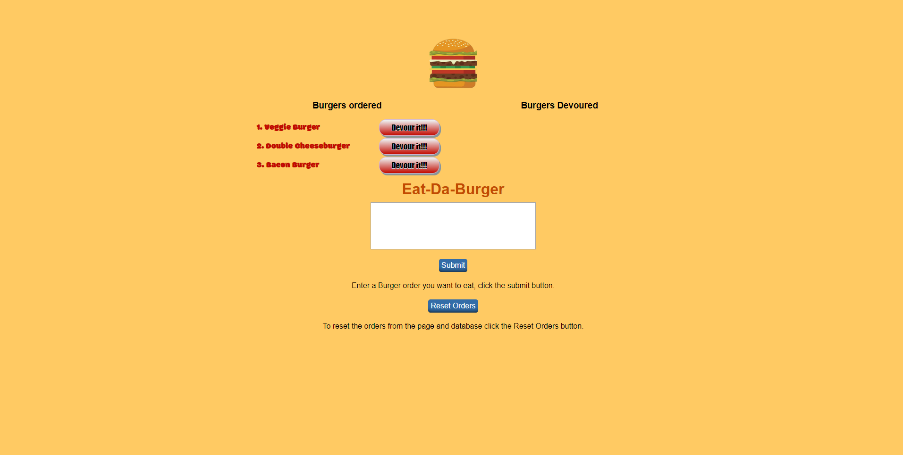

# Eat-Da-Burger

Assignment 13 for Georgia Tech Coding Bootcamp focusing on making an MVC app using node, express, handlebars and mysql

## Getting Started
Inside this repo there are mysql seed files to build a starting repo, the logic has been set for a clearDB configuration on heroku.
A live version of the site can be found at the following. https://eat-all-of-da-burger.herokuapp.com/

## Site Goals

Steps in site revolve around using  crud operators.

* <b>Create</b>: Using the form.  
* <b>Read</b>: Diplay the data in the view.  
* <b>Update</b>: With devour button.  
* <b>Delete</b>: With the reset orders button.

Live Link at: https://eat-all-of-da-burger.herokuapp.com/

